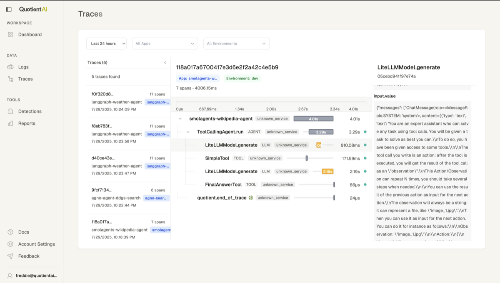

# Why Traces?
Traces are a way to capture the full context of an agent's interaction with a user. They are a powerful tool for debugging and understanding the behavior of your agent.

Quotient captures traces to provide you with information for debugging and understanding the behavior of your agent, and also to help you automatically understand how people are using your agent with [Quotient Reports](../tools/reports).

# Initialize the Tracer

Initialize the Quotient tracer with configuration settings for your application:

```python
from quotient import Quotient

quotient = Quotient()

quotient.tracer.init(
    app_name="my-first-app",
    environment="dev",
    # optional: run detections on your traces
    detections=[DetectionType.HALLUCINATION, DetectionType.DOCUMENT_RELEVANCY],
)
```

### Parameters:

* `app_name` **(string)**: Name of your application. Core parameter used to identify the source of logs in the Quotient dashboard.
* `environment` **(string)**: Environment where your application is running (e.g., "dev", "staging", "prod"). Core parameter used to help segregate logs by deployment environment.
* `detections` **(array)**: List of detection types to run. Available options:
  - `DetectionType.HALLUCINATION` - Detects potential hallucinations in model outputs
  - `DetectionType.DOCUMENT_RELEVANCY` - Evaluates how relevant retrieved documents are to the user query

# Send Traces

We provide a decorator to trace agent interactions. The decorator will automatically capture the agent's input, output, tool calls, and any relevant context.

We integrate with [OpenInference](https://github.com/Arize-ai/openinference) for OpenTelemetry instrumentation, to automatically capture traces for different LLM providers and agent frameworks. 

We use the OpenInference semantic conventions for the trace data, and also have our own [semantic conventions specifically for vector databases](#vector-database-semantic-conventions).

You can find examples below for how we integrate for different frameworks.

### Agent SDKs

#### Agno

```
pip install quotientai agno duckduckgo-search openinference-instrumentation-agno
```

```python quotient_trace_agno.py
# setup the quotient tracer
from openinference.instrumentation.agno import AgnoInstrumentor

from quotientai import QuotientAI

quotient = QuotientAI()
quotient.tracer.init(
    app_name="agno-search-app",
    environment="dev",
    instruments=[AgnoInstrumentor()],
)

# setup your agno agent with the Quotient tracer
from agno.agent import Agent
from agno.models.openai import OpenAIChat
from agno.tools.duckduckgo import DuckDuckGoTools

@quotient.trace('agno-agent-ddgs-search')
def run_agno():
    agent = Agent(
        model=OpenAIChat(id="gpt-4o-mini"), 
        tools=[DuckDuckGoTools()],
        markdown=True, 
    )

    agent.print_response("What is currently trending in AI?")

if __name__ == "__main__":
    run_agno()
```

#### OpenAI Agents SDK

```
pip install quotientai openai openinference-instrumentation-openai-agents
```

```python quotient_trace_openai_agents.py
# setup the quotient tracer
from openinference.instrumentation.openai_agents import OpenAIAgentsInstrumentor

from quotientai import QuotientAI

quotient = QuotientAI()
quotient.tracer.init(
    app_name="openai-agents-search-app",
    environment="dev",
    instruments=[OpenAIAgentsInstrumentor()],
)

# setup your openai agents with the Quotient tracer
import asyncio
from agents import Agent, Runner

@quotient.trace('haiku-agent')
async def main():
    agent = Agent(
        name="haiku-assistant",
        instructions="You only respond in haikus.",
    )

    result = await Runner.run(agent, "Tell me about recursion in programming.")
    print(result.final_output)

if __name__ == "__main__":
    asyncio.run(main())
```


#### LangGraph

```
pip install quotientai langgraph openinference-instrumentation-langchain
```

```python quotient_trace_langgraph.py
# setup the quotient tracer
from openinference.instrumentation.langchain import LangChainInstrumentor

from quotientai import QuotientAI

quotient = QuotientAI()
quotient.tracer.init(
    app_name="langgraph-weather-app",
    environment="dev",
    instruments=[LangChainInstrumentor()],
)

# setup your langgraph agent with the Quotient tracer
from langgraph.prebuilt import create_react_agent

def get_weather(city: str) -> str:  
    """Get weather for a given city."""
    return f"It's always sunny in {city}!"

@quotient.trace('langgraph-weather-agent')
def main():
    agent = create_react_agent(
        model="anthropic:claude-3-7-sonnet-latest",  
        tools=[get_weather],  
        prompt="You are a helpful assistant"  
    )
    agent.invoke(
        {"messages": [{"role": "user", "content": "what is the weather in sf"}]}
    )

if __name__ == "__main__":
    main()
```


#### Smolagents

```
pip install quotientai smolagents openinference-instrumentation-smolagents
```

```python quotient_trace_smolagents.py
# setup the quotient tracer
from openinference.instrumentation.smolagents import SmolagentsInstrumentor

from quotientai import QuotientAI

quotient = QuotientAI()
quotient.tracer.init(
    app_name="smolagents-weather-app",
    environment="dev",
    instruments=[SmolagentsInstrumentor()],
)

# setup your smolagents agent with the Quotient tracer
import requests

from smolagents import ToolCallingAgent, LiteLLMModel, tool

@tool
def search_wikipedia(query: str) -> str:
    """
    Fetches a summary of a Wikipedia page for a given query.
    Args:
        query: The search term to look up on Wikipedia.
    Returns:
        str: A summary of the Wikipedia page if successful, or an error message if the request fails.
    Raises:
        requests.exceptions.RequestException: If there is an issue with the HTTP request.
    """
    url = f"https://en.wikipedia.org/api/rest_v1/page/summary/{query}"

    try:
        response = requests.get(url)
        response.raise_for_status()

        data = response.json()
        title = data["title"]
        extract = data["extract"]

        return f"Summary for {title}: {extract}"

    except requests.exceptions.RequestException as e:
        return f"Error fetching Wikipedia data: {str(e)}"


@quotient.trace('smolagents-wikipedia-agent')
def main():
    model = LiteLLMModel(model_id="gpt-4o")

    agent = ToolCallingAgent(
        tools=[search_wikipedia],
        model=model,
    )
    agent.run("What happened in the 2024 US election?")

if __name__ == "__main__":
    main()
```

# View Traces

You can view traces in the [Quotient Web UI](https://app.quotientai.co/traces) by clicking on the "Traces" tab, and selecting your `app_name` and `environment` as well as time range.



## Adding Custom Spans

You can also add custom spans to traces to capture additional information with `start_span` or the OpenTelemetry `get_current_span` method.

```python
from opentelemetry.trace import get_current_span

from quotientai import QuotientAI
from quotientai.tracing import start_span

quotient = QuotientAI()

quotient.tracer.init(
    app_name="my-app",
    environment="dev",
)

@quotient.trace('smolagents-wikipedia-agent')
def main():
    # start a custom span
    with start_span('custom-span'):
        # do something
        span = get_current_span()
        span.set_attribute('custom_attribute', 'custom_value')

        # do something else
        span = get_current_span()
        span.set_attribute('custom_attribute', 'custom_value')

        # do something else

if __name__ == "__main__":
    main()
```

## Vector Database Semantic Conventions

We have our own semantic conventions for vector databases to help you understand how vector databases are being used.

We currently support instrumenting the following vector databases:

- [Qdrant](https://qdrant.tech/)
- [Pinecone](https://pinecone.io/)
- [Chroma](https://www.trychroma.com/)

### Basic Usage

```python
from quotientai import QuotientAI, ChromaInstrumentor, PineconeInstrumentor, QdrantInstrumentor

# Initialize QuotientAI client
quotient = QuotientAI()

# Initialize tracing with vector database instrumentors
quotient.tracer.init(
    app_name="my-app",
    environment="production",
    instruments=[
        ChromaInstrumentor(),
        PineconeInstrumentor(),
        QdrantInstrumentor(),
    ],
)
```


### Common Attributes

| Attribute | Type | Description | Example |
|-----------|------|-------------|---------|
| `db.system.name` | string | Vector database system name | `"chroma"`, `"pinecone"`, `"qdrant"` |
| `db.operation` | string | Database operation type | `"query"`, `"add"`, `"upsert"`, `"delete"` |
| `db.collection.name` | string | Collection/index name | `"user_profiles"` |
| `db.operation.status` | string | Operation status | `"completed"`, `"error"` |
| `db.ids_count` | int | Number of IDs processed | `150` |
| `db.vector_count` | int | Number of vectors processed | `320` |
| `db.n_results` | int | Number of results returned | `15` |
| `db.query.retrieved_documents` | string | JSON string of retrieved documents | `[{"id": "doc1", "score": 0.95, ...}]` |

### Database-Specific Attributes

#### ChromaDB
- `db.documents_count`: Number of documents processed
- `db.metadatas_count`: Number of metadata entries
- `db.filter`: Applied filters (JSON string)
- `db.where_document`: Document filter conditions

#### Pinecone
- `db.index.name`: Index name
- `db.index.dimension`: Index dimension
- `db.create_index.metric`: Distance metric used
- `db.create_index.spec`: Index specifications
- `db.query.namespace`: Query namespace
- `db.delete_all`: Whether all records are deleted
- `db.update.id`: ID being updated
- `db.update.metadata`: Metadata being updated

#### Qdrant
- `db.collection.dimension`: Collection dimension
- `db.limit`: Query limit
- `db.offset`: Query offset
- `db.filter`: Applied filters (JSON string)
- `db.operation.id`: Operation ID for async operations

### Document Format

The `db.query.retrieved_documents` attribute contains a JSON string with the following structure:

```json
[
  {
    "document.id": "doc123",
    "document.score": 0.95,
    "document.content": "document text content",
    "document.metadata": "{\"source\": \"web\", \"category\": \"tech\"}"
  }
]
```

### Error Handling

All instrumentors gracefully handle missing dependencies:

- If a vector database library is not installed, the instrumentor will log a warning and skip instrumentation
- If instrumentation fails, the original functionality is preserved
- Errors during operation tracing are logged but don't affect the underlying operation
