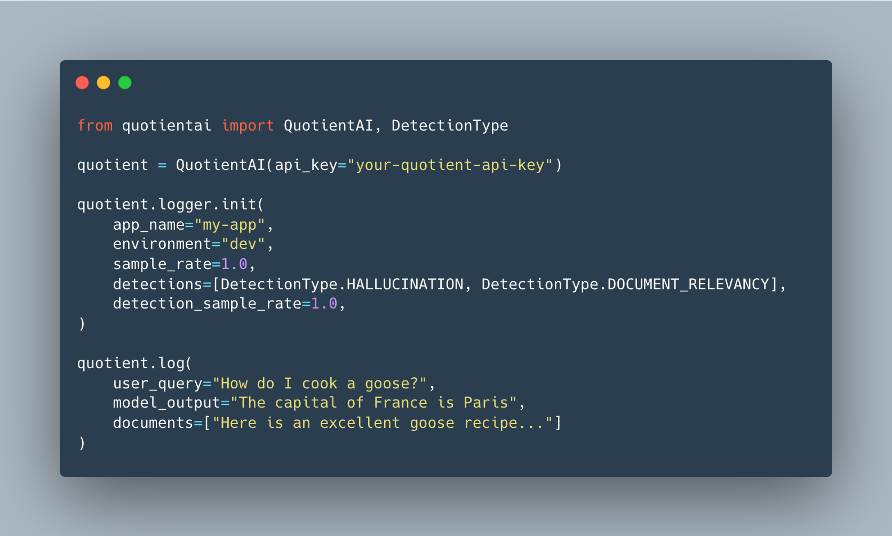

Quotient provides intelligent observability for AI apps by automatically detecting problems, identifying root causes, and providing visibility -- see what's broken, where it happens, and why.

## 🧠 Why Quotient AI?

Quotient Detections enables you to automatically catch hallucinations and other reliability issues in your AI outputs as you log responses. You can:

- Track and measure the reliability of your LLM-powered applications
- Identify which retrieved documents contributed to generated responses
- Calculate hallucination rates across different environments
- Flag responses that cannot be traced back to source documents

all with the Quotient SDK in Python or TypeScript.

## How does it work?

### Seamless Integration

With just a few lines of code, our lightweight SDK connects to your application and streams structured logs.

### Advanced Issue Detection

Our algorithms analyze logs to detect hallucinations, inconsistencies, and other mission-critical issues.

### Actionable Insights

Get a clear dashboard with detailed diagnostics on what’s wrong, where it’s happening, and how to resolve it.

### Want to get started?

Check out our [Quickstart](/quickstart) page.

We're actively developing new features and capabilities. Have ideas or specific needs? Reach out to our founders directly at **[contact@quotientai.co](mailto:contact@quotientai.co)**.

Follow our [blog](https://www.quotientai.co/blog-index) for insights on AI development and evaluation.

