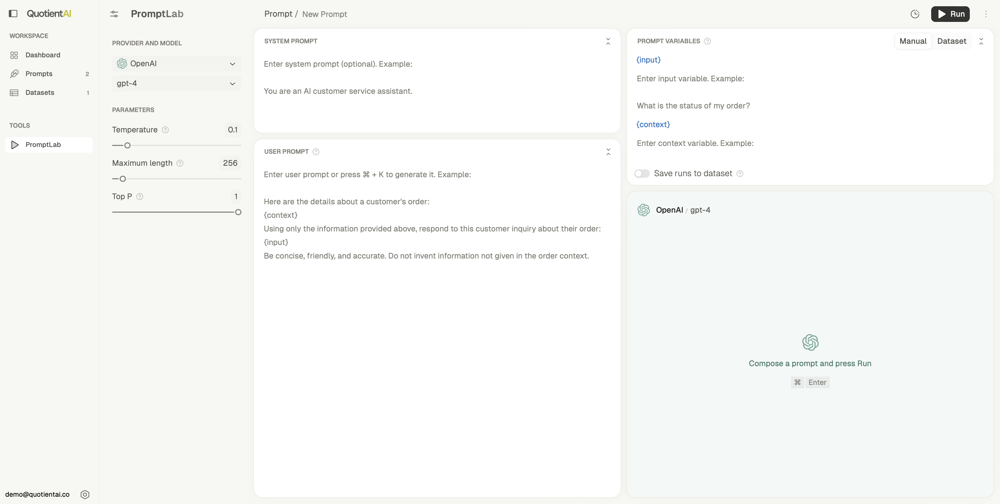
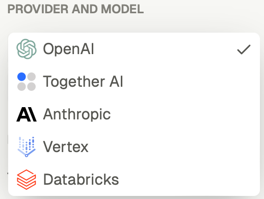
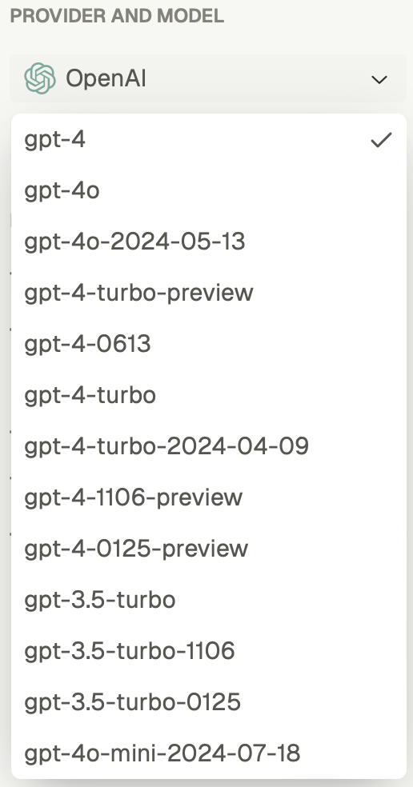
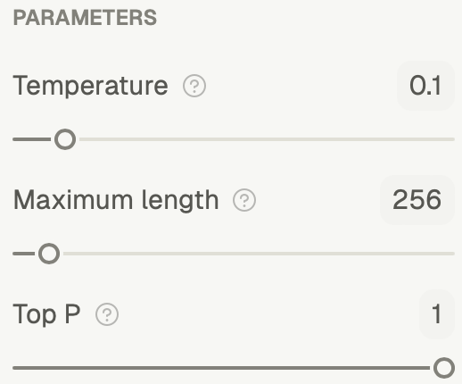
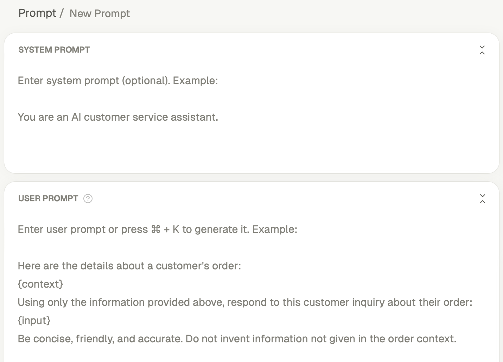
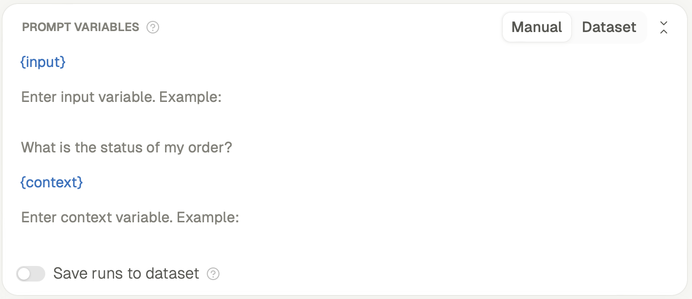
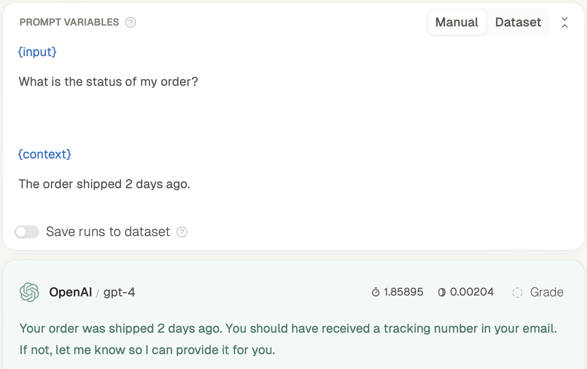
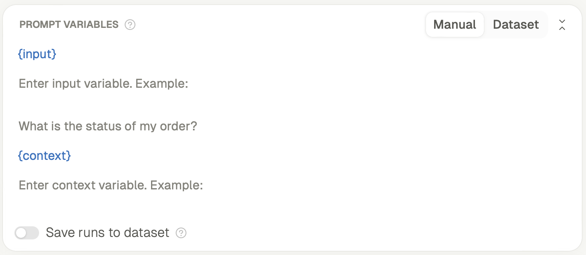
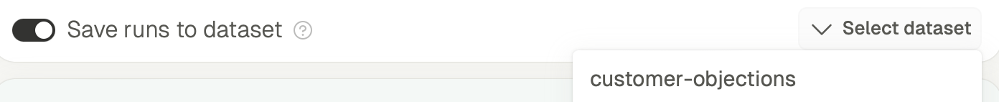

# 🎯 Bootstrap dev and eval via PromptLab

Welcome to PromptLab, your playground for prototyping and testing prompts. Here's how to start building with AI models:



## 📝 Get started

**PromptLab** is available within [Quotient's platform](app.quotientai.co).

### 1. **Choose your model**
Select your LLM provider (like OpenAI or Anthropic) and specific model in the left panel labeled **Provider and Model**.





### 2. **Adjust model parameters**
Adjust temperature, max length, and top P to control output behavior:
- **Temperature**: Adjust this slider to control the randomness of the model’s responses. A higher value (e.g., 0.8) results in more random outputs, while a lower value (e.g., 0.1) produces more deterministic results.
- **Maximum Length**: Set the maximum number of tokens the model can generate.
- **Top P**: Controls the cumulative probability for token sampling. Higher values include more token possibilities in the output.



### 3. **Define your prompts**

- **System Prompt**: Provide instructions to guide the model’s behavior. This prompt shapes the assistant’s tone and approach.

    Example:
    ```txt
    You are an AI customer service assistant.
    ```

- **User Prompt**: Enter the main user prompt that the model will respond to. For instance:
    ```txt
    Here are the details about a customer’s order: {{context}}. Using only the information provided, respond to this inquiry about their order: {{input}}.
    Be concise and accurate. Avoid inventing information not present in the context.
    ```



### 4. **Input variables**

- The panel on the right is where you define **Prompt Variables**.
- You may use `{{input}}` and `{{context}}` as variables to dynamically pass values during prompt execution. This allows for flexibility in testing different inputs.



#### Example input and context:

For example, you can provide the following input and context:

- **Input**: "What is the status of my order?"
- **Context**: "The order shipped 2 days ago."



---

## 🚀 Run your prompt

Once you’ve set up your prompt, you’re ready to run it:

1. Click the **Run** button located at the top right of the interface.
2. Watch how the model processes your input and returns an output based on the system and user prompts you’ve configured.

You can switch between **Manual** and **Dataset** mode to decide how you want to feed inputs into the system.


If you choose to provide inputs manually, you will have to enter new inputs during each run. 



If you decide to use a dataset to provide inputs, you can easily switch between entries in the dataset across runs.


Once you have completed a few runs, you may also save these to a new dataset to use in future iterations. 



---

## 🔄 Iterate and improve

To get the best performance out of PromptLab, experiment with different configurations and prompt setups. Here are a few strategies to refine your prompts:

### 1. **Test with different temperatures**
   - Adjust the **Temperature** setting to explore how randomness impacts the generated responses. Lower values will produce more factual and concise outputs, while higher values generate more creative and varied responses.

### 2. **Save runs to dataset**
   - Toggle the **Save runs to dataset** button if you want to track and store all your test runs for future evaluation or comparison.

---

## 🧠 Advanced features

PromptLab offers IQ, which is an AI assistant to help you refine your prompts. IQ offers real-time prompt optimization by automatically adjusting prompts based on feedback, helping you continuously improve your AI's responses. As you provide feedback, IQ intelligently suggests changes, allowing you to accept or reject them while maintaining control over your prompt. This feedback loop ensures that your prompts evolve and improve with each iteration, leading to better, more accurate outputs. For more details on Quotient IQ, check out the [IQ documentation](./iq.mdx).

---

## 💡 Best practices

- **Be specific**: Ensure your prompts are clear and well-defined to avoid ambiguity in the AI’s responses.
- **Iterate**: Test multiple configurations to determine the most effective prompt setup for your model.

---

## ❓ Need help?

If you need additional assistance or have any feature requests, please reach out to our founders at **[contact@quotientai.co](mailto:contact@quotientai.co)**.

Happy prompt engineering! 🎉