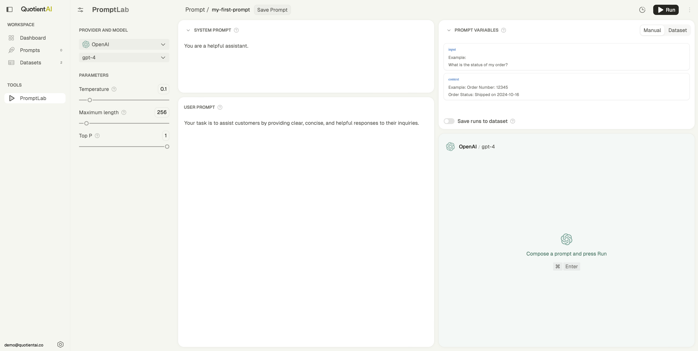
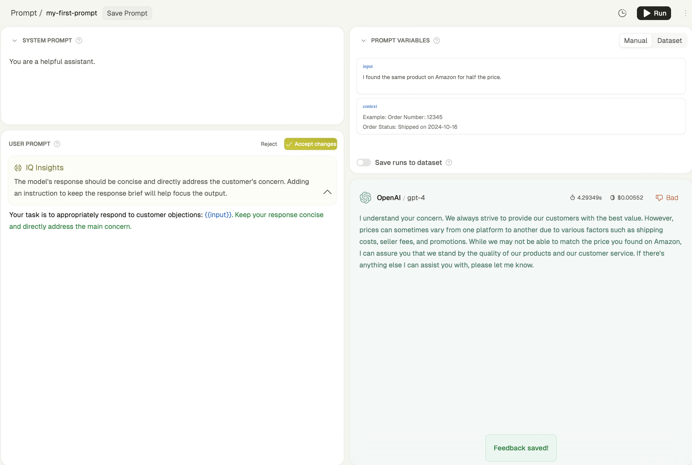

<Steps>
  <Step title="Install the Quotient SDK">
    <CodeGroup>
      <CodeBlock filename="Python">
      ```python
      pip install quotientai
      ```
      </CodeBlock>
      <CodeBlock filename="TypeScript">
      ```typescript
      npm install quotientai
      ```
      </CodeBlock>
    </CodeGroup>
  </Step>
  <Step title="Create an API Key">
    Next, create an API key to authenticate yourself. You can create an API key in your [settings](https://app.quotientai.co).

    <Tip>
      [Watch `API Key Creation` on YouTube](https://youtu.be/F5tMAsckl_c)
    </Tip>

  </Step>
  <Step title="Create a Script">
    Create a script with the following code:

    <CodeGroup>
      <CodeBlock filename="Python">
        ```python prompting.py
        from quotientai import QuotientAI

      # initialize the quotient client
      quotient = QuotientAI()

      # create a prompt
      prompt = quotient.prompts.create(
        name="my-first-prompt",
        system_prompt="You are a helpful assistant.",
        user_prompt="Your task is to assist customers by providing clear, concise, and helpful responses to their inquiries"
      )

        print(prompt)
        ```
      </CodeBlock>
      <CodeBlock filename="TypeScript">
        ```typescript prompting.ts
        import { QuotientAI } from 'quotientai';

        const quotient = new QuotientAI();

        const prompt = await quotient.prompts.create({
          name: "my-first-prompt",
          systemPrompt: "You are a helpful assistant.",
          userPrompt: "Your task is to assist customers by providing clear, concise, and helpful responses to their inquiries"
        });

        console.log(prompt);
        ```
      </CodeBlock>
    </CodeGroup>
  </Step>
  <Step title="Run the Script">
    Using your API key, run the script to create your first prompt:
    <CodeGroup>
      <CodeBlock filename="Python">
        ```console
        QUOTIENT_API_KEY=your-api-key python prompting.py
        ```
      </CodeBlock>
      <CodeBlock filename="TypeScript">
        ```console
        QUOTIENT_API_KEY=your-api-key npx ts-node prompting.ts
        ```
      </CodeBlock>
    </CodeGroup>
  </Step>
  <Step title="Open in PromptLab">
    You just created your first prompt! Now can go to the Quotient Web UI and open your prompt [PromptLab](https://app.quotientai.co/prompts).

    Hit `Run` and see what happens!

    
    
    <Tip>
      [Watch `PromptLab Demo` on Youtube](https://youtu.be/LLjlatYsaM8)
    </Tip>
  </Step>
  <Step title="Iterate with IQ">
    Tell IQ what you think can be better about the model output and start prototyping on your next project.

    
    
    <Tip>
      [Watch `Quotient IQ` on Youtube](https://youtu.be/X668xN83Z4A)
    </Tip>
  </Step>
</Steps>
