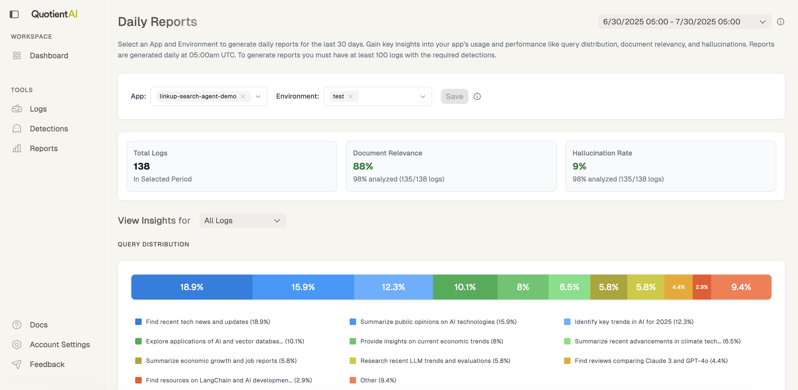
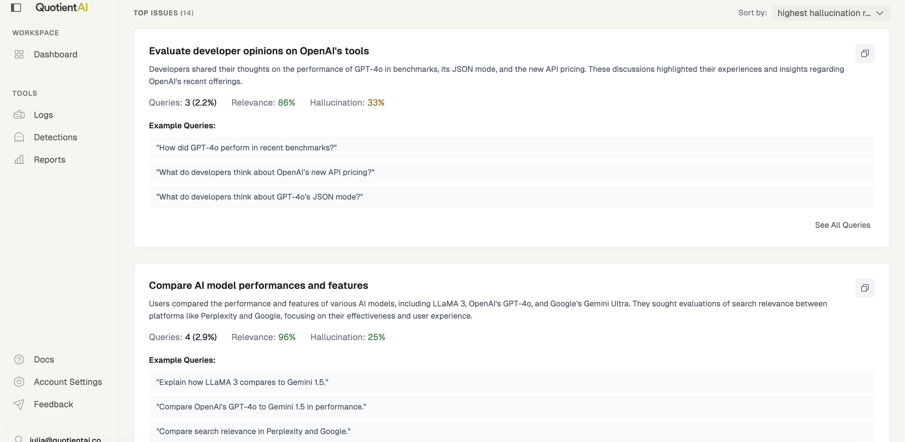

# Why Reports?

Reports are a way to automatically understand how people are using your agent. They are a powerful tool for debugging and understanding where to focus your development efforts.

They give you a daily snapshot of your users’ queries, clustered by topic and ranked by risk. They combine semantic grouping with relevance and hallucination detections to highlight where things might be going wrong. 

## How to Integrate Reports

Reports are automatically generated based on the logs and traces you send to Quotient. Reports are available once 100+ [detections](/tools/detections) have been generated within a 30 day window. You can find more information on how to send logs and traces below:

- [Logs](/data-collection/logs)
- [Traces](/data-collection/traces)

## When to Use Reports

The Reports feature is particularly valuable for:

- **Content Gap Analysis**: Identify topics where your agent consistently struggles
- **Query Optimization**: Find patterns in queries that lead to poor results
- **Resource Allocation**: Focus improvements on high-volume or high-risk areas
- **Trend Monitoring**: Track how system performance changes over time

