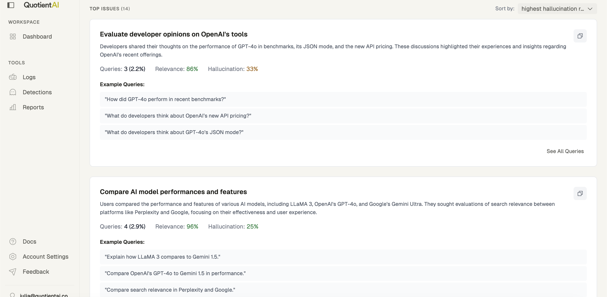

<CardGroup>
  <Card title="Integration" icon="handshake" href="/tools/reports/integration">
    Learn how detections, logs, and traces feed report generation.
  </Card>
  <Card title="When to Use" icon="book-copy" href="/tools/reports/when-to-use">
    Spot the scenarios where reports accelerate iteration.
  </Card>
</CardGroup>

# Why Reports?

Reports automatically surface how people are interacting with your agent, giving you a daily snapshot of user queries clustered by topic and ranked by risk. They combine semantic grouping with relevance and hallucination detections to highlight where your agent might be struggling.

## What Reports deliver

- **Daily digests** that summarize top intents, risky clusters, and notable regressions.
- **Issue drill-downs** that link directly to representative logs and detection evidence.
- **Trend charts** that make it easy to spot regressions after prompt, retriever, or model changes.

## Inside the dashboard

- **Overview**: high-level traffic, detection rates, and surfaced clusters for the past 24 hours.
- **Issues**: deep dives into specific query clusters with sample conversations and affected customers.
- **Filters**: slice every panel by tag (environment, customer tier, model version) to focus on the traffic that matters.

<Tip>
  Reports unlock once Quotient has processed at least 100 detections in a rolling 30-day window. Keep detections enabled during onboarding to hit the threshold quickly.
</Tip>

Next: [How to Integrate Reports](./integration).
